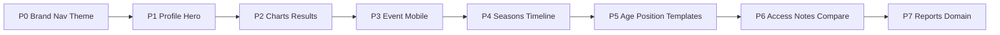

# 60'6" ID — Phased Revision Plan

**Constraints (locked):** Improve existing app only. Keep accounts, evaluations, and data. Keep demo org names (`PBG Midwest` / `PBG South`) as tenant data. Strip **product** branding of PBG Scout / Velo City. Defer AI rankings, recruiting marketplace, payments, etc. (your §24).

**Codebase reality (from audits):** Radar + overall line charts, 8-tab profile, verified metrics, goals, media/consent, invite codes, mobile offline eval already exist. Biggest gaps: product naming/nav, black-white-red athletic look, large photo hero + 6 cards, bar/metric/completion charts, seasons model, age-aware templates, expiring staff access, player comparison.

---

## Phase 0 — Brand, nav, visual system
**Goal:** App reads as **60'6" ID** in under a second; Scout = feature/role, not product name.

- Rename UI copy: Landing, SignIn, [`AppLayout.js`](frontend/src/components/layout/AppLayout.js) logo fallback, Dashboard (“Scout Dashboard” → Dashboard / ID home), [`index.html`](frontend/public/index.html) title/meta.
- Tagline on Landing only: *Every Player. Every Rep. Every Season Tells the Story.* Motto *Train. Elevate. Succeed.* sparingly (login/footer), not every page.
- Simplify nav toward: Dashboard · Players · Evaluations · Events · Progress · Scout · Reports · Administration (map existing routes: review→Evaluations, development→Progress, templates/drills/staff/audit→Administration group). Keep role-gated visibility.
- Theme: black / white / **red** athletic system in [`index.css`](frontend/src/index.css) + [`tailwind.config.js`](frontend/tailwind.config.js) (replace orange-as-primary if needed). Reduce dense text on Dashboard.
- Add favicon/logo placeholders under `frontend/public/` (real mark when available).
- **Do not** rename seed orgs or `*@pbgscout.com` emails.

**Done when:** Hard refresh shows 60'6" ID; no “PBG Scout” / “Velo City” product chrome; nav matches vision; palette is B/W/red.

---

## Phase 1 — Player profile hero (5-second test)
**Goal:** Open a player and instantly know who they are, position, score, trend, strengths/needs, metrics, last eval.

- Redesign [`PlayerProfile.js`](frontend/src/pages/PlayerProfile.js) header: large photo, name, permanent ID (display format on existing UUID), grad year, age group, positions, B/T, **height/weight** (already in model), team/org, last eval, profile completion %, verified badge.
- Six quick cards: overall score · score change · # evals · verified measurements · current goal · last updated.
- Restructure tabs toward Overview / Evaluations / Progress / Verified Metrics / Player Story / Media / Coach Notes / Development Goals / Events / (stubs OK for Seasons/Rankings/Private until later phases).
- Overview: visual-first (radar + short bullets); long text behind “View details.”
- Profile completion: compute missing photo/height/weight/recent eval/approved video; show % + missing list.

**Done when:** Staff + athlete-facing summary pass the §25 five-second test without losing detail behind expanders.

---

## Phase 2 — Charts + evaluation results hierarchy
**Goal:** Level-1 visual summary everywhere results appear; Level-2 full text expandable.

- Charts (Recharts already available): skill radar (enhance), overall progress line, previous-vs-current **bar**, verified metrics compare (prev / PB / age-group benchmark where data exists), profile completion, wire into profile + eval results.
- Evaluation results UX: overall · change · top 3 strengths/needs · charts · recommendation · next date; full write-up under “View Full Evaluation.”
- Metric verification labels already partly exist—make badges visually distinct (Athlete/Parent/Coach/Event/Device/60'6" Verified).
- Avoid fake benchmarks; only show age/position benchmarks when defined in catalog/config.

**Done when:** Profile + eval result pages lead with visuals; no wall of paragraphs first.

---

## Phase 3 — Event manager dashboard + mobile eval polish
**Goal:** Camp-day ops are visual and phone-friendly.

- Event progress tab ([`EventDetail.js`](frontend/src/pages/EventDetail.js)): chart/cards for registered / checked-in / in progress / complete / missing; evaluator + station completion; click player → incompletes.
- Mobile eval polish on existing [`Evaluate.js`](frontend/src/pages/Evaluate.js) / [`EvaluationForm.js`](frontend/src/pages/EvaluationForm.js): completion %, missing-score warning, jersey/bib search if fields exist, clearer save/offline status (keep autosave/offline).
- Media in eval: improve capture UX (camera capture where browser allows); keep consent; note offline queue as stretch if time.

**Done when:** Manager sees camp status in seconds; evaluator loop stays fast on phone.

---

## Phase 4 — Permanent ID seasons + unified story timeline
**Goal:** One athlete identity across years; seasons nested, never erase history.

- Add `athlete_seasons` (or equivalent) under athlete: year, team, org, age group, height/weight snapshot; link evals/metrics/media/goals/awards/events by date or `season_id`.
- Profile **Seasons** section + Career overview; never overwrite prior seasons.
- Unify staff Timeline + public Story into a richer visual timeline (date, event, short description, verification, media thumb, deep link).
- Display permanent **60'6" ID** number consistently (stable id; optional human-readable code later).

**Done when:** Multi-season player shows history without duplicate profiles.

---

## Phase 5 — Age- and position-specific evaluations
**Goal:** Right form for the athlete.

- Extend age bands: 7U–8U through College/Pro in [`routes_players.py`](backend/routes_players.py) / seed helpers.
- Make `resolve_template` use **age_group + position** (today age is label-only in [`positions.py`](backend/positions.py)).
- Seed/admin templates per band (younger: movement/fundamentals; older: verified tools/projection).
- Keep Templates admin CRUD reorder/add/remove; only show categories that apply to positions/event.

**Done when:** Starting an eval for a 10U OF vs 17U pitcher yields different templates automatically.

---

## Phase 6 — Access control, notes, comparison
**Goal:** Temporary staff access + richer notes + up-to-4 player compare.

- Invite redeem: add membership/`assignment` expiry tied to event end or TTL; Site Manager revoke immediate (codes already revoke).
- Note types + visibility (general / development / private staff / parent-visible / scout / follow-up); never overwrite—append only (extend [`routes_development.py`](backend/routes_development.py)).
- Player comparison (≤4): side-by-side cards + charts for authorized roles; new API + page under Scout/Reports.
- Ensure evaluators never see private parent/medical/financial fields (audit serializers).

**Done when:** Temp coach sees only assigned station/players; compare view is visual, not a text dump.

---

## Phase 7 — Reports polish + domain readiness
**Goal:** Dependable exports; path to final domain.

- Enhance player/progress/event reports with charts where PDF/HTML allows; keep CSV; improve missing-data and evaluator disagreement views ([`Reports.js`](frontend/src/pages/Reports.js), [`routes_reports.py`](backend/routes_reports.py)).
- Domain: keep `606-scout.surge.sh` for testing; document cutover to `id.606athletics.com` (or `app.`); optional try `606scout.surge.sh` if free—**not** blocking product work.
- Update [`USER_GUIDE.md`](USER_GUIDE.md) for 60'6" ID naming + phased features (no deploy secrets to CEO).

**Done when:** Reports match visual-first standard; domain path documented.

---

## Explicitly out of scope (until later)
Automated AI rankings, scholarship/draft predictions, recruiting marketplace, public social feed, payments, memberships, nutrition, advanced biomechanics, public rankings for young children.

---

## How we’ll execute
After you approve this plan: **Phase 0 first**, then stop for a quick visual check, then Phase 1, etc. Each phase ships working UI against existing data—no big-bang rewrite.
