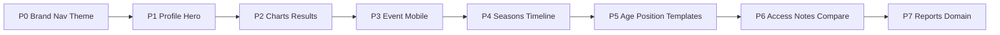

# 60'6" ID — Phased Revision Plan

## Revision 2 — Next priorities (received 11 Aug 2026, event in 5 days)

Coach G's follow-up direction. Core rule: **keep everything working; change presentation, focus,
and role-first framing.** Build order as given: (1) evaluation workflow reliability + field UX,
(2) results UX, (3) profile visual hierarchy, (4) progressive disclosure, (5) role dashboards,
(6) grad-year navigation, (7) Organization HQ, (8) development/video refinement. Roadmap items
(T.E.S. method, AI development plans, drill assignment loop, badges, admin scheduling) are
explicitly deferred — do not build before the event.

In flight (file-partitioned, six workstreams):
- **Field mode** — EvaluationForm/Evaluate: sticky athlete photo/name/bib header, minimal chrome,
  bigger touch targets, bib-labeled prev/next; save/offline logic untouched by hard constraint.
- **Role dashboards + Org HQ** — Dashboard/AppLayout: evaluator "Evaluation Mode", coach
  "My Athletes", head-scout review-first, owner "Organization HQ" (org identity + `logo_url`
  prominent, "60'6\" ID powering {org}"), development-first stats.
- **Athlete "My Development"** — MyId: development delta headline, TOP 3 priorities
  (current → target), PB chips, what's-next; never more than 3 weaknesses at once.
- **Digital player card** — PlayerProfile hero: "2029 | SS/3B | R/R" identity line, 4–6 KPIs
  (Current Evaluation, Development ↑, verified Exit Velo / 60-yd, Current Goal, Profile %),
  progress-before-ranking ordering.
- **Backend** — `graduation_year` list filter + `/athletes/grad-years`, `/reports/insights`
  (top movers, needs review, flagged, position snapshot, development trend), `/organizations/summary`
  + `logo_url` on org.
- **Grad-year nav + Scout board + Reports landing** — PlayersList "Class of" chips with
  deep-linking, Scout prospect board (grad/pos/verified metrics/trend/compare), Reports leading
  with six insight cards above the existing tables.

Verified no-op: §9 media structure already supports the future film/feedback/drill split
(athlete/event/evaluation/season linkage + consent + privacy are all on the row; drills are a
separate collection). Nothing to change now.

## Revision 3 — UI/UX & role efficiency (received 12 Aug 2026)

Client's standing rules for this and future revisions: **UI/UX, navigation, hierarchy, and
role-based efficiency only** — no rebuilds, no data-structure changes unless unavoidable, no new
major features (AI/badges/payments/marketplace/scheduling stay roadmap). **The evaluation
workflow is FROZEN** (Event → Assignment → Athlete → Evaluation → Autosave/Offline →
Metrics/Notes/Media → Submit → Review → Approve → Results) while the client field-tests it with
the playbook — no agent may touch those files.

In flight (file-partitioned, five workstreams):
- **Roster backend** — `GET /athletes/overview` (per-athlete score/trend/status in a handful of
  queries, no N+1), derived `GET /teams` + `/teams/{name}/summary` over the existing
  `current_team` string (no schema change), per-user scout watchlist endpoints.
- **Players page** — grad-year DROPDOWN (chips retired), class snapshot strip
  (Athletes | Evaluated | Improving | Needs Follow-Up), Card/List toggle, photo-first cards,
  meaningful status chips (Follow-Up, Needs Evaluation, PB, New Video, Improving, Evaluated —
  generic "Active" demoted), consolidated control bar, Quick View dialog before the full profile.
  Import/Export/Add preserved. "Premium athlete development roster, not a database."
- **Role-mode nav + command center** — Owner/Admin "Organization HQ" (Overview | Teams | Athletes
  | Development | Events), Coach Hub, Evaluation Mode (Today's Event | Evaluate | Submitted),
  Scout Mode (Discover | Watchlist | Compare | Events) with Review kept prominent for head scout;
  everything demoted stays in Administration. HQ cards become clickable controls; grad classes
  become a dropdown; recently-added players get real photos.
- **Teams pages** — /teams and /teams/{name}: derived roster/dev/eval drill-ins; grad chips link
  into filtered Players.
- **Scout Mode** — Discover | Watchlist tabs; star-to-watch on prospect cards; Compare stays the
  EXISTING comparison (no duplicate system).

---

**Status note (August 2026):** every phase below was previously marked `completed`. A full
verification pass — eight independent code audits plus runtime testing — found that only Phase 0
held up. Phases 1 and 3 were close; Phases 2, 4, 5, 6 and 7 were partial or, in two cases, had a
headline feature that did not function at all. Statuses were reset honestly and the phases
re-scoped against the full revision request. See
`../ClaudeBackground/REVISION-PLAN-VERIFICATION.md` for the original evidence.

**Revision pass outcome (this session).** The gaps above were then worked through against the
25-section revision request. Verified at runtime (local Mongo, live server, 30/30 org-isolation
tests passing, clean frontend build):

- **Phase 5 (age/position templates) — the broken headline is fixed.** Resolution is genuinely
  age-aware: 10U P and 17U P now resolve to different, age-appropriate forms; a 17U DH no longer
  falls to a 7U fundamentals form. 49 seeded templates span all eight §8 bands; legacy labels still
  resolve. Proven by direct `resolve_template` calls.
- **Phase 2 (results + verification) — built.** New `/evaluations/{id}/results` endpoint and page
  lead with overall/change/top-3 strengths/needs/radar and hide prose behind *View Full Evaluation*.
  The metric-key mismatch that made benchmarks dead is fixed; the comparison endpoint now returns
  percentiles. Six verification sources are live end-to-end with role-based write rules.
- **Phase 3 (event/mobile/media) — hardened.** IndexedDB draft store + service worker (cold offline
  reload works), quota-safe writes, offline media queue, camera preview/retake/size-guard. Event
  dashboard "in progress" reads real numbers; per-player incomplete drill-down added.
- **Phase 6 (access/notes/compare) — assignment expiry now enforced** (a coach invite was writing
  no assignment at all, so access never expired); two confidential-note leaks closed; evaluator
  redaction unified on the shared helper.
- **Phase 7 (reports) — PDF now carries real vector charts and 60'6" branding**; progress report,
  category ranking, position comparison, and a severity-scored disagreement view added; CSV
  unchanged.
- **Phases 1 & 4 — profile completion no longer caps at 80%, two dead tabs fixed, two-level
  hierarchy added, Career Overview added; athlete edits now snapshot prior physicals so history is
  never erased.**
- **Engineering debt:** the two Emergent dependencies that broke `pip install` are removed; the
  local-Mongo TLS boot blocker is fixed.

**Second wave (this session, continued).** The gaps the first wave left were then worked through and
verified at runtime (re-seed, live server, 30/30 org-isolation tests, clean build):

- **Email is wired (§12, new Phase 8).** Resend (free tier: 3,000/mo) via `mailer.py`, provider-agnostic
  with a dev-stdout fallback, branded HTML + text, one automatic retry, and `safe_send` so a mail
  outage never rolls back the surrounding action. Event **access codes now actually email** to a
  brand-new coach (previously only an in-app notification to existing users). No invitation token is
  ever returned in an API response once mail is configured. **The user must create the Resend account
  and verify a sending domain** — documented in `.env.example`.
- **Season linkage is now functional (§6).** Seasons carry date ranges; a two-season demo athlete's
  metrics and evaluations split correctly across seasons (proven: 2026 → 4 evals + 2 metrics, 2025 →
  1 metric); `/athletes/{id}/career` aggregates across seasons; a re-runnable, idempotent backfill
  links historical records. The append-only evaluation write path was deliberately NOT touched —
  evaluations group by event date at read time.
- **Timeline unified (§7).** One shared `TimelineItem` component + `_story_entries` builder feeds both
  the staff timeline and public story; new event kinds emit (`joined`, `season_started` proven live,
  plus achievement/personal_best); verification badges and thumbnails on items.
- **Also landed:** event manager dashboard frontend (§13/§4F), player comparison backend + page with
  evaluator lockout proven 403 (§18), template admin UI — create/edit/delete/reorder categories (§8),
  full development-goal + note fields (§15/§17), position-applicability category filter (§9), media
  privacy enforcement (§11), nav simplified to the §20 list (Programs → Administration).

**Still genuinely open** (documented per-phase below): USER_GUIDE refresh and the domain DNS cutover
(§19/§21, ops); "position change / new team" timeline events need a stored history table that does
not exist; real-device testing of the offline path + camera before 16 Aug; broader automated test
coverage beyond org-isolation. "Mark private" is now enforced server-side.

---

## Locked constraints

**Improve the existing app. Do not rebuild.** Keep existing player information, logins,
evaluations, data, working pages and user accounts.

**Branding is 60'6" Athletics only.** The product is **60'6" ID**. "Scout" is a feature and a staff
role inside the platform — never the product name. The feature may be called **60'6" Scout Mode**.
Do not display Velo City or PBG Scout product branding anywhere in the UI. The demo tenants
`PBG Midwest` / `PBG South` and the `*@pbgscout.com` seed accounts are **tenant data and stay** —
they are not product branding.

- **Product name:** 60'6" ID
- **Tagline:** *Every Player. Every Rep. Every Season Tells the Story.* (Landing only)
- **Motto:** *Train. Elevate. Succeed.* (sparingly — login/footer, not every page)
- **What it does, in one line:** "60'6" ID gives every athlete one permanent player profile that
  stores evaluations, verified measurements, videos, coach feedback and year-to-year development."

**Two-level information rule (§3).** Every results surface leads with a Level-1 visual summary
understandable in five seconds, with Level-2 full detail behind *View Full Evaluation* / *View
Coach Notes* / *View Full Report*. Detail is never deleted — only moved beneath the summary.

**Never fabricate data.** Benchmarks, percentiles and comparisons render only when actually defined
in the catalog/config. A missing benchmark is omitted, never invented. The same rule applies to
dashboard metrics: return null rather than a placeholder number.

**Safety and integrity rules.** Evaluations are append-only — never overwrite a submitted
evaluation, never overwrite an older note. Every mutation writes an audit entry. Every query filters
on `organization_id`. Under-13 consent gating is legally required; youth photos and videos are never
publicly displayed without approval.

**Out of scope until the core is dependable (§24):** automated AI rankings, scholarship and draft
predictions, recruiting marketplace, public social feed, payments, training memberships, nutrition,
advanced video biomechanics, public rankings for young children.

---

---

## Phase 0 — Brand, nav, visual system  ✅ verified complete
*Covers §1, §20, §22, §23*

**Goal:** App reads as 60'6" ID in under a second.

Verified in place: `index.html` title/meta, Landing, SignIn, `AppLayout` logo, Dashboard headings;
tagline confined to Landing; motto on Landing + SignIn only; nav mapped (review→Evaluations,
development→Progress, admin group); palette is genuinely black/white/red (`--primary: 0 72% 50%`,
zero orange remaining); favicon present; seed orgs and emails correctly preserved.

**Remaining minor gaps:** no logo placeholder asset beyond the favicon, no `manifest.json` /
apple-touch-icon / `.ico` fallback. `Programs` is a ninth primary nav item beyond the §20 list —
fold it under Events or Administration. Stale "ported from Velo City" source comment in
`IdRadarChart.js`. Optional: `pbg_*` localStorage key prefixes still carry the old name (renaming
needs a session migration path).

---

## Phase 1 — Player profile hero (the five-second test)
*Covers §5, §25, and the §3 two-level rule*

**Goal:** Open a player and instantly know who they are, position, score, trend, strengths, needs,
verified measurements and last evaluation.

**Verified done:** hero header with all §5 fields (large photo, name, permanent ID, grad year, age
group, positions, B/T, height/weight, team, org, last eval, completion %, verified badge); all six
quick cards; the twelve profile sections in §5 order.

**Still to do:**
- **Profile completion is capped at 80% for every player.** The approved-video check reads `media`
  state that is only fetched when the Media tab is opened, so it is always empty on load. Fetch a
  lightweight has-approved-video flag on mount, or compute completion on the backend.
- The video predicate checks `media_type`/`content_type` but the rest of the page uses `file_type` —
  align it.
- "Recent evaluation" is implemented as "any evaluation ever" — add a date window.
- **No "View details" expander exists anywhere.** The scout assessment prose and a twelve-row metric
  table sit unbounded on the Overview tab, which violates §3. `accordion.jsx` is present and unused.
- Overview needs short strengths/needs bullets, not just charts.
- Completion is frontend-only and duplicated inconsistently in `MyId.js` (a boolean nag on a
  different field set) — make one source of truth.
- `MyId.js` lacks the permanent ID, completion %, and the grad-year/bats/throws fields its API
  already returns.

**Fixed during verification:** the Player Story tab fetched on a tab value that did not exist
(permanent skeleton); the Awards tab had working UI but was missing from `PROFILE_TABS`.

**Done when:** a staff user and an athlete/parent both pass the §25 five-second test, with full
detail still reachable behind expanders.

---

## Phase 2 — Charts and the evaluation results hierarchy
*Covers §3, §4A–E, §14, §16*

**Goal:** Level-1 visual summary everywhere results appear; Level-2 full text expandable.

**Verified done:** skill radar, overall progress line, previous-vs-current bar, and a completion
gauge — all real Recharts, all wired into the player profile. Benchmarks are a real org-scoped
collection, and no fabricated benchmark is displayed anywhere.

**Still to do:**
- **The evaluation results page does not exist (§14).** `/evaluation/:id` maps to the data-entry
  form with fields disabled. Build the results view: overall score, score change, top three
  strengths, top three areas for improvement, radar, progress chart, verified measurements, coach
  recommendation, next evaluation date — with the full written evaluation behind *View Full
  Evaluation*.
- `recommendation` and `next_evaluation_date` have no backend fields — add them.
- Top-3 strengths/needs must be derived from structured category scores, not parsed from the
  free-text blobs.
- **Verified metrics comparison chart (§4D) is missing** — compare each metric against previous,
  personal best, age-group benchmark and position benchmark. The Verified Metrics tab is a plain
  card list today.
- **Metric key namespaces do not match**, so benchmarks never resolve: the catalog uses
  `exit_velo`/`sixty_yd`/`pitch_velo` while benchmarks use
  `exit_velocity`/`sixty_yard_dash`/`pitching_velocity`. Standardise on the canonical nine and alias
  the legacy keys on read so historical rows survive.
- **Verification badges (§16) do not exist end-to-end** — no enum in the backend, no styles in
  `StatusBadge.js`, no source picker in the metric form, so `source` is always empty. Add the six
  sources (Athlete / Parent / Coach Submitted, Event / Device / 60'6" Verified) with verified tiers
  visually distinct from unverified.
- `IdRadarChart`'s `benchmarkData` overlay prop exists but no caller supplies a series.
- Event completion chart (§4F) — see Phase 3.

**Done when:** profile and evaluation-result surfaces lead with visuals, never a wall of paragraphs.

---

## Phase 3 — Event manager dashboard, mobile evaluation, media capture
*Covers §4F, §10, §11, §13*

**Goal:** Camp-day operations are visual, fast on a phone, and do not lose work on bad wifi.

**Verified done:** the evaluate loop (completion %, missing-score warning, save-status pill with six
states and tap-to-retry, autosave with debounce, conflict detection via `client_updated_at`,
exponential backoff); consent enforced client- and server-side with under-13 forced to
pending; station and evaluator completion on the progress tab.

**Fixed during verification — this was the most serious defect found:** the autosave path deleted
the local draft when the server response carried no explicit acknowledgement. A captive portal (the
wifi at a gym or ballpark) answers HTTP 200 with an HTML interstitial, producing exactly that. The
evaluator saw "Synced" and a completed evaluation was silently lost. It now requires the explicit
ack its own comment already described.

**Still to do:**
- **Offline persistence is `localStorage` only** — no IndexedDB, no service worker, no quota
  handling. A cold page load while offline fails entirely. This is the single largest event-day
  risk (§10: "Do not lose evaluations when the internet connection is weak").
- "Players in progress" always reads 0 — the progress endpoint never returns the drafts count it
  already computes per station.
- Coaches get a permanently blank Live Progress tab: the UI shows it to coaches, the endpoint
  refuses them, the 403 is swallowed, and it is the default tab during a live event.
- **Per-player incomplete drill-down does not exist** (§13: "click a player and immediately see what
  is incomplete") — no UI, no endpoint.
- Jersey-number search is dead code — the roster endpoint never returns `jersey_number`.
- §13 metrics still missing: average evaluation time, players flagged for review, videos awaiting
  approval, internet sync problems.
- Media capture (§11) is a bare `capture="environment"` attribute — no preview, retake,
  compression, or size guard, and no offline media queue (an offline capture is lost). §11 also
  wants an explicit profile-photo capture path and per-media captions.

**Done when:** a manager sees camp status in seconds, and the evaluator loop stays fast and lossless
on a phone with unreliable wifi.

---

## Phase 4 — Permanent 60'6" ID, seasons, and the story timeline
*Covers §6, §7*

**Goal:** One athlete identity across years. Seasons nest under it; history is never erased.

**Verified done:** the `athlete_seasons` collection with create/list/patch endpoints, a Seasons
panel on the profile, and a stable permanent-ID format (`606-XXXXXXXX`).

**Still to do:**
- **Seasons link to nothing.** No `season_id` on evaluations, metrics, media, goals, awards or
  events, and seasons carry only an integer `year` with no date range, so nothing can be grouped by
  date either. §6 requires each season to store evaluations, metrics, notes, videos, goals, awards,
  events and rankings.
- **`PATCH /athletes/{id}` blind-overwrites height, weight and current_team with no season
  snapshot** — the "never erase history" promise is unenforced in the write path.
- No Career Overview (§6).
- **The staff Timeline and the public Story were never unified** (§7) — two endpoints, two
  renderers, divergent schemas, divergent sources. Only the tab label changed. §7 also requires
  media thumbnails and a deep link on every item; both are absent from both implementations, and
  verification status appears on only one.
- §7 timeline event types not yet emitted: joined 60'6", position change, new team, achievement
  earned, season started.
- **The permanent ID renders on one screen only** — missing from My ID, the ID card and the public
  Story.
- No `athlete_seasons` index; no seeded multi-season athlete, so the acceptance criterion has never
  been executed; no tests.

**Done when:** a multi-season player shows full history under one profile, with no duplicate
profiles and nothing overwritten.

---

## Phase 5 — Age- and position-specific evaluations
*Covers §8, §9*

**Goal:** The right form for the athlete, chosen automatically.

**Status: the headline feature does not function.** Verified by calling the resolver directly
against seeded data — a 10U and a 17U pitcher receive the identical form, and a 17U designated
hitter falls through to the org default, which is an 8U-10U fundamentals form. The phase's own
acceptance test appeared to pass only because a 10U OF and a 17U P differ *by position*, exactly as
they did before the phase was written.

Root cause: no seeded template carries both an `age_group` and `applies_to_positions`, so the age
tiebreaker never finds an age-compatible candidate and silently returns the first candidate, while
the age-only branch explicitly excludes any template that has positions.

**To do:**
- **Adopt the §8 bands, which differ from what was built.** Canonical set: `7U-8U`, `9U-10U`,
  `11U-12U`, `13U-14U`, `15U-16U`, `17U-18U`, `College`, `Professional`. Currently seeded:
  `8U-10U`, `11U-13U`, `14U-18U`. Legacy stored labels must keep resolving.
- Make age part of the resolution key, not a tiebreaker. Precedence: age+position → age+position
  group → position → position group → age → station default → org default. When no age match
  exists, say so in the returned reason instead of silently returning the first candidate.
- Seed a real template matrix so age differentiates. Younger bands weight movement, coordination,
  fundamentals, effort, confidence, coachability, baseball awareness. Older bands weight verified
  measurements, position tools, game performance, hitting approach, defensive impact, baseball IQ,
  physical projection, consistency, recruitability.
- Support the §9 position categories: Hitting, Infield, Outfield, First Base, Catching, Pitching,
  Base Running, Athleticism, Baseball IQ, Character and Coachability.
- **Only show categories that apply** (§9) — an infielder must not be shown catching categories
  unless catching is one of their positions. No such filter exists today.
- **Templates admin has no create, delete, reorder, or age-band editor** — §8 requires
  administrators to change, add, remove and reorder categories. Backend CRUD supports it; the UI
  does not expose it.
- The offline template resolver (`templateCache.js`) ignores age entirely, so offline and online
  resolution can disagree.

**Done when:** a 10U outfielder and a 17U pitcher automatically receive different, age-appropriate
templates — and a 10U pitcher and a 17U pitcher do too.

---

## Phase 6 — Access control, notes, comparison
*Covers §12, §15, §17, §18*

**Goal:** Temporary staff access that genuinely expires, richer notes, and visual player comparison.

**Verified done and genuinely good:** all six note types with visibility buckets, append-only
enforced (insert-only, no update or delete path anywhere), and visibility filtering on both the
staff and parent/athlete list endpoints. Membership-level expiry is properly enforced on every
request, so revoke takes effect despite the seven-day JWT. Player comparison renders real radar and
bar charts, not a text dump.

**Fixed during verification — two confirmed leaks of confidential data:** `GET
/athletes/{id}/summary` and the coach-facing player PDF both returned confidential scout notes with
no visibility check, while `/notes` correctly hid them. The summary endpoint is open to evaluators,
and it is what the comparison page calls. Both now filter through the shared visibility helper.

**Still to do:**
- **Assignment-level expiry and revoke are inert** — `expires_at` and `active` are written to
  `evaluator_assignments` and never read by any query. A permanent member who redeems an event
  invite deliberately gets no *membership* expiry because expiry is attached "only on assignment",
  and that is precisely the half that does nothing. §12 item 7 requires access to expire when the
  event is over.
- `GET /evaluations/{id}` hand-rolls a four-field redaction covering guardian fields only — it
  misses medical, insurance, financial and SSN. Use the shared `restrict_guardian` helper. §12 is
  explicit that coaches must not automatically see private parent info, emergency contacts, medical
  or financial information.
- **Player comparison has no backend endpoint** — the max-4 limit is UI-only and the route guard
  admits evaluators. §18 says "authorized coaches or scouts".
- Comparison must cover the full §18 list: player info, position, evaluation scores, verified
  measurements, progress, videos, age group, evaluation history.
- Development goals (§15) exist but need the full field set: recommended action, assigned coach,
  start date, target date, current progress, follow-up evaluation date.
- Notes need `related_event` and `follow_up_date` surfaced per §17.
- Three note queries omit `organization_id` (defense-in-depth; the parent athlete is org-scoped
  first).
- `restrict_guardian(a, "athlete")` on the athlete's own record is a no-op that reads as protection
  which is not there.

**Done when:** a temporary coach sees only their assigned station and players, access ends with the
event, and comparison is visual and properly authorized.

---

## Phase 7 — Reports and domain readiness
*Covers §19, §21*

**Goal:** Dependable, visual exports and a documented path to the final domain.

**Verified done:** CSV export intact; leaderboard and completion tabs have real charts; `DOMAIN.md`
documents the cutover to `id.606athletics.com` (primary) / `app.606athletics.com` (alias) with a
six-step checklist.

**Still to do:**
- **The player PDF has no charts at all** — it is tables and paragraphs. §19 requires visual charts.
  ReportLab supports them; it was not attempted.
- The PDF still carries pre-Phase-0 branding: navy/gold colours, a hardcoded `"PBG Midwest"`
  fallback, and the old tagline "Identify. Evaluate. Develop. Connect." **This is a live branding
  violation in the one artifact that leaves the app.**
- **No progress report exists** in any form, despite being named in §19.
- The evaluator-disagreement view was never touched — no chart, no severity threshold, and the
  `stdev` the backend computes is never displayed.
- §19 report types still missing: category ranking, position comparison.
- `Reports.js` never links the player PDF and never surfaces the comparison page.
- **USER_GUIDE.md documents none of the phased features** — no seasons, comparison, note types, age
  bands or expiring access; the nav table is stale; one "Velo-style" reference remains in a
  CEO-facing document.
- Credential hygiene: `USER_GUIDE.md` publishes plaintext demo passwords alongside the live hosted
  URL. `.env.fly.local` and `.env.hf.local` hold real credentials — gitignored and absent from
  history, but they travel if the folder is zipped.
- §21: `606-scout.surge.sh` stays for testing only. Optionally try `606scout.surge.sh` — not
  blocking.

**Done when:** reports meet the visual-first standard, carry only 60'6" branding, and the domain
cutover is documented.

---

## Cross-cutting engineering debt

Not in the revision request, but it gates the work above.

- **`backend/requirements.txt` still lists `emergentintegrations` and a private Emergent-hosted
  `litellm` wheel**, neither of which the code imports. `pip install -r` fails on a clean machine
  against that gated URL. Two-line deletion.
- **`tests/test_core.py` collects zero tests** under pytest — an Emergent-era script pointing at
  port 8001. Real automated coverage is `test_org_isolation.py` alone (30 tests, all passing).
  Nothing tests template resolution, seasons, note visibility, scoring, or the offline path.
- **Zero database transactions.** Every multi-document write can partially fail.
- **No email service is wired** for invitations or password resets.

---

## Execution order

Event-day reliability first (Phase 3 offline hardening, then the progress-dashboard defects), then
the security items in Phase 6, then Phase 5 — it is the phase whose headline behaviour is furthest
from its claimed status. Phases 1, 2, 4 and 7 are product polish and follow.

Each phase ships working UI against existing data. No big-bang rewrite.
